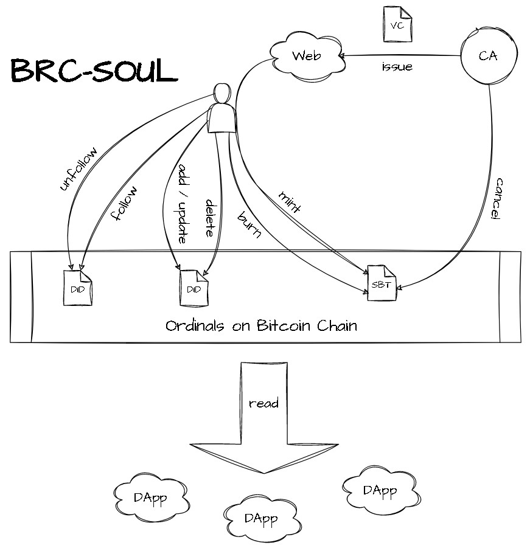

# brc-soul
This is only a preliminary draft.
Although it is based on the CySo (CyberSoul) protocol I designed on ETH before, 
it is still imperfect and requires community discussion and improvement.

## What
brc-soul is a Bitcoin blockchain profile protocol, it's decentralized and safe,
which will be the basis of many DApps on the Bitcoin.

DID(decentralized identifier) is a decentralized identity system that is not
restricted by centralized institutions and remains under your control forever. 

VC(verifiable credentials) are digital certificates that help prove an individual's or 
system's identity, similar to a physical passport or driver's license.

SBT(soulbond tokens) are permanently tied to the address that first inscribes them,
non-transferable, ensuring the credibility of the corresponding address identity.

## Why
The lack of regulation in the crypto space brings freedom but also comes with scams.
Addressing trust issues in anonymous scenarios becomes crucial. This can significantly
reduce trust costs and, consequently, increase productivity in the crypto world.
DID, VC, and SBT can effectively solve decentralized trust issues and have important
applications in scenarios such as:

1. Lending platforms can adjust corresponding collateral ratios based on the credibility of addresses, thereby improving capital utilization efficiency.
2. Individuals can assess the credibility of a project based on the reputation of the project initiator's address and decide whether to invest or not.
3. Individuals can develop their social circles in the crypto world based on the credibility of addresses.
4. and so on...

Why should use the Bitcoin chain?
1. Applications on Bitcoin are just emerging, and there is currently no related protocol for a DID identity system. This is an important area in the crypto community.
2. Bitcoin is currently the most secure chain, and personal identity information is the most important information for everyone, so it should be stored on the most secure chain.
3. The various DID identity systems on different chains have caused severe fragmentation in the ecosystem. Bitcoin's position is the most hopeful for standardizing DID identity systems.

## How

### DID profile opration

**add/update profile attribute**

    {
      "p": "brc-soul",              //protocol
      "op": "attr",                 //attribute option
      "seq": 0,                     //option sequence, should always increase at the same address
      "attr": {                     //profile attributes
        "name": "qrpaper",          //profile name
        "icon": "ordi://53098586",  //optional profile icon, may be stored in ipfs, http, ordi and so on
        "xuri": "external json"     //optional extended profile attribute, may be stored in ipfs, http, ordi and so on
      },
      "sign": "IClzsZoHbyZuC0+H6D4WCAOSRA3Jm6YZQr9aB/ebI4PPKkw+82zvxI+6/jBv5Xa5nWT1C6L6rplU8f3oE1co7Oo=" //BIP137Signature of all the above message with creator private key
    }

**delete profile attribute**

    {
      "p": "brc-soul",
      "op": "attr",
      "seq": 0,
      "attr": {
        "xuri": null                //set any field to be null to delete the field
      },
      "sign": "xxx"                 
    }

### Certificate Authority operation

**issue SoulBound Token**

    {
      "vc": {
        "vcid": number,             //VC id, should be identity in the same CA address
        "addr": "bc1p3lpgz3246uqc87zp8ex7s7q6xka0z9g0djv9n0e2a3gqqlcetl4stwgrqd", //CA address
        "attr": {                   //VC attributes
          "tick": "vc-name",        //VC name
          "level": 5,               //optional VC level
          "score": 100,             //optional VC score
          "xuri": "external json"   //optional extended VC attribute, may be stored in ipfs, http, ordi and so on
        },
        "sign": "xxx"               //BIP137Signature of all the above messages in vc with CA's private key
      }   
    }

VC(Verifiable Credentials) is issued by CA(Certificate Authority) through CA's private web server

**cancel SoulBound Token**

    {
      "p": "brc-soul",
      "op": "cancel",               //cancel VC option
      "vcid": number,               //cancel VC id
      "sign": "xxx"
    }

cancel should be inscribed to CA's address

### Certificate Receiver operation

**mint SoulBound Token**

    {
      "p": "brc-soul",
      "op": "mint",                 //mint VC option
      "seq": 0,
      "vc": {
        "vcid": number,
        "addr": "ca-addr",
        "attr": {
          "tick": "vc-name",
          "level": 5,
          "score": 100,
          "xuri": "external json"
        },
        "sign": "xxx"               //sign of VC
      }   
      "sign": "xxx"                 //sign of option
    }

**burn SoulBound Token**

    {
      "p": "brc-soul",
      "op": "burn",                 //burn VC option
      "seq": 0,
      "vcid": number,
      "addr": "ca-addr",
      "sign": "xxx"
    }

## Note
* The inscription is only valid to its creator, Once effective, the transferability of inscriptions does not correlate with the inscribed information.
* The sign must be from the creator, to avoid others' poison.
* seq is not needed continuously but must be increased, to avoid replay attack.
* attr field can be extended by the application itself, but there will be some standard fields.
* vcid must not be duplicated in the same address, but different address can have the same vcid.
* ca-addr and vcid, together, they ensured the uniqueness of the CV.
* sign message field should be Sorted alphabetically, then serialized, and remove formatting whitespace.
* xuri is optional extended attribute, may be stored in ipfs, http, ordi and so on.
