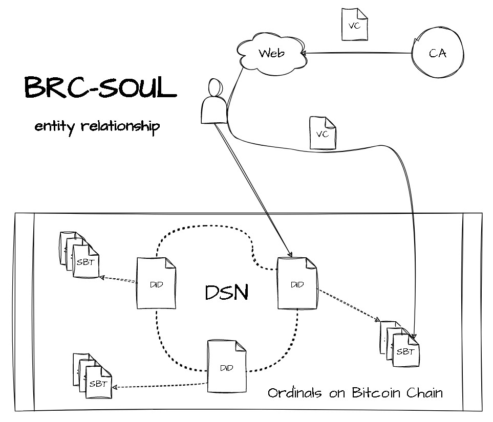
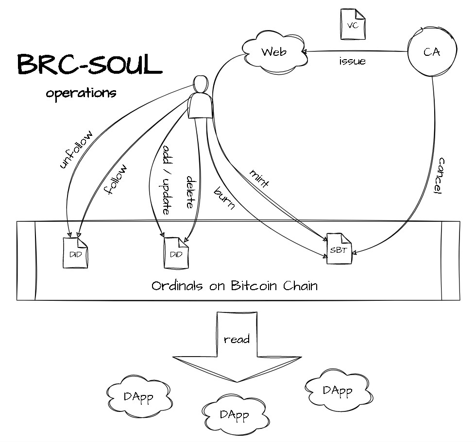

# brc-soul
This is only a preliminary draft.
Although it is based on the CySo (CyberSoul) protocol I designed on ETH before, 
it is still imperfect and requires community discussion and improvement.

## What
brc-soul is the first Bitcoin Social Protocol, it's decentralized and safe,
which will be the basis of many DApps on the Bitcoin.

**DID(decentralized identifier)** is a decentralized identity system that is not
restricted by centralized institutions and remains under your control forever. 

**VC(verifiable credentials)** are digital certificates that help prove an individual's or 
system's identity, similar to a physical passport or driver's license.

**CA(Certificate Authority)** is the entity who issues VC, every one can be CA, the CA's
authority can also be analyzed on the chain.

**SBT(soulbond tokens)** are VCs minted on the chain, it permanently tied to the address that first 
inscribes them, non-transferable, ensuring the credibility of the corresponding address identity.

**DSN(Decentralized Social Network)** store social network data decentralizedly to allow you 
build your social network and reputation continuously. It is consists of all above entities.

## Why
The lack of regulation in the crypto space brings freedom but also comes with scams.
Addressing trust issues in anonymous scenarios becomes crucial. This can significantly
reduce trust costs and, consequently, increase productivity in the crypto world.
brc-soul can effectively solve decentralized trust issues and have important
applications in scenarios such as:

1. Lending platforms can adjust corresponding collateral ratios based on the credibility of addresses, thereby improving capital utilization efficiency.
2. Individuals can assess the credibility of a project based on the reputation of the project initiator's address and decide whether to invest or not.
3. Individuals can develop their social circles in the crypto world based on the credibility of addresses.
4. The decentralized relationship can be stored on the chain forever, without restriction of any centralized app.
5. Every app use the same data, we would never need build our social network and reputation again and again.
6. and so on...

Why should use the Bitcoin chain?
1. Applications on Bitcoin are just emerging, and there is currently no related protocol for a DID identity system. This is an important area in the crypto community.
2. Bitcoin is currently the most secure chain, and personal identity information is the most important information for everyone, so it should be stored on the most secure chain.
3. The various DID identity systems on different chains have caused severe fragmentation in the ecosystem. Bitcoin's position is the most hopeful for standardizing DID identity systems.

## How

### DID Profile opration

**add/update did attribute**

    {
      "p": "brc-soul",                  //protocol
      "op": "did",                      //attribute option
      "opid": number,                   //option id, should be identity in the same address, to avoid replay attack, timestamp seconds from 1970-01-01 00:00:00 UTC can be used
      "attr": {                         //optional did attributes
        "name": "did-name",             //optional did name
        "icon": "ordi://53098586",      //optional did icon, may be stored in ipfs, http, ordi and so on, default is ordi
        "xuri": "external json"         //optional extended did attribute, may be stored in ipfs, http, ordi and so on, default is ordi
      },
      "sign": "IClzsZoHbyZuC0+H6D4WCAOSRA3Jm6YZQr9aB/ebI4PPKkw+82zvxI+6/jBv5Xa5nWT1C6L6rplU8f3oE1co7Oo=" //BIP137Signature of all the above message with creator private key
    }

**delete did attribute**

    {
      "p": "brc-soul",
      "op": "did",
      "opid": number,
      "attr": {                         //set attr to be null to delete all the field
        "icon": null,                   //set any field to be null to delete the field
        "xuri": null                    //set any field to be null to delete the field
      },
      "sign": "xxx"                 
    }

### Certificate Authority operation
**create/update VC collection**

    {
      "p": "brc-soul",
      "op": "creupd",                 //create/update VC option
      "opid": number,
      "coid": number,                 //VC collection id, should be identity in the same CA did
      "attr": {                       //optional VC collection attributes
        "name": "vc-collection-name", //optional VC collection name, '!' used as reserved character, to allow expanding the protocol
        "icon": "ordi://53098586",    //optional VC collection icon, may be stored in ipfs, http, ordi and so on, default is ordi
        "xuri": "external json"       //optional extended VC collection attribute, may be stored in ipfs, http, ordi and so on, default is ordi
      },
      "sign": "xxx"
    } //create should be inscribed to CA's address

**issue Verifiable Credential**

    {
      "vc": {
        "caid": number,                 //CA did
        "coid": number,                 //VC collection id, should be identity in the same CA did
        "vcid": number,                 //VC id, should be identity in the same CA did
        "attr": {                       //optional VC attributes
          "level": 5,                   //optional VC level
          "score": 100,                 //optional VC score
          "todid": number,              //optional only allow specified did to mint
          "expire": 1706146997,         //optional expire timestamp seconds from 1970-01-01 00:00:00 UTC
          "xuri": "external json"       //optional extended VC attribute, may be stored in ipfs, http, ordi and so on, default is ordi
        },
        "sign": "xxx"                   //BIP137Signature of all the above messages in vc with CA's private key
      }   
    } //VC is issued by CA through CA's private web server

**cancel Verifiable Credential**

    {
      "p": "brc-soul",
      "op": "cancel",                   //cancel VC option
      "vcids": [num1, num2, ..., numn]  //cancel VC id
      "sign": "xxx"
    } //cancel should be inscribed to CA's address

### Certificate Receiver operation

**mint SoulBound Token**

    {
      "p": "brc-soul",
      "op": "mint",                     //mint SBT option
      "vc": {
        "caid": number,
        "coid": number,
        "vcid": number,
        "attr": {
          "level": 5,
          "score": 100,
          "todid": number,
          "expire": 1706146997,
          "xuri": "external json"
        },
        "sign": "xxx"                   //sign of VC
      }   
      "sign": "xxx"                     //sign of option
    }

**burn SoulBound Token**

    {
      "p": "brc-soul",
      "op": "burn",                     //burn SBT option
      "caid": number,
      "vcid": number,
      "sign": "xxx"
    }

### Social Network operation

**follow did**

    {
      "p": "brc-soul",
      "op": "fol",                      //follow option
      "opid": number,
      "dids": [did1, did2, ..., didn]
      "sign": "xxx"
    }

**unfollow did**

    {
      "p": "brc-soul",
      "op": "unfol",                    //unfollow option
      "opid": number,
      "dids": [did1, did2, ..., didn]
      "sign": "xxx"
    }

**group operations**

    group related operation can be realized by CV related operation
    "apply" : user apply through dapp to join group
    "issue" : group manager sign and issue CV to allow user join the group
    "mint"  : user mint the CV as SBT to join the group
    "burn"  : user burn the CV to leave the group
    "cancel": group manager can cancel the CV to remove a member
    we define the "vc-collection-name" that start with "grp!" is a group verification collection

## Note
* DID number is allocated at the first time people use "did" operation of the brc-soul protocol validly, it is start from one, zero used as reserved number.
* The inscription is only valid to its creator, Once effective, the transferability of inscriptions does not correlate with the inscribed information.
* The sign must be from the creator, to avoid others' poison.
* "opid" should be identity in the same address, to avoid replay attack, timestamp seconds from 1970-01-01 00:00:00 UTC can be used.
* SBT related opration "mint", "burn", "cancel" are no "opid" field, because the "caid"+"vcid" can distinct them, and we define the burn token can not be remint
* "attr" field can be extended by the application itself, but there should be some standard fields.
* "caid" is the CA did of CA, so CA should create their DID first before issue VC.
* "coid" must not be duplicated in the same CA did, but different CA can have the same coid.
* "vcid" must not be duplicated in the same CA did, but different CA can have the same vcid.
* "caid" and "vcid", together, they ensured the uniqueness of the CV.
* "vc-collection-name" shouldn't use '!', this is used as reserved character, to allow expanding the protocol.
* "sign" message field should be sorted alphabetically, then serialized, and remove formatting whitespace.
* "xuri" is optional extended attribute, may be stored in ipfs, http, ordi and so on, default is ordi.

## Contact us
1. issues: <https://github.com/qrpaper/brc-soul/issues>
2. email: <coffeeking001@outlook.com>
3. telegram: <https://t.me/qrpaper>
4. discord: <https://discord.gg/3MjNRBhuRv>
5. twitter: <https://twitter.com/qrpaper_sats>